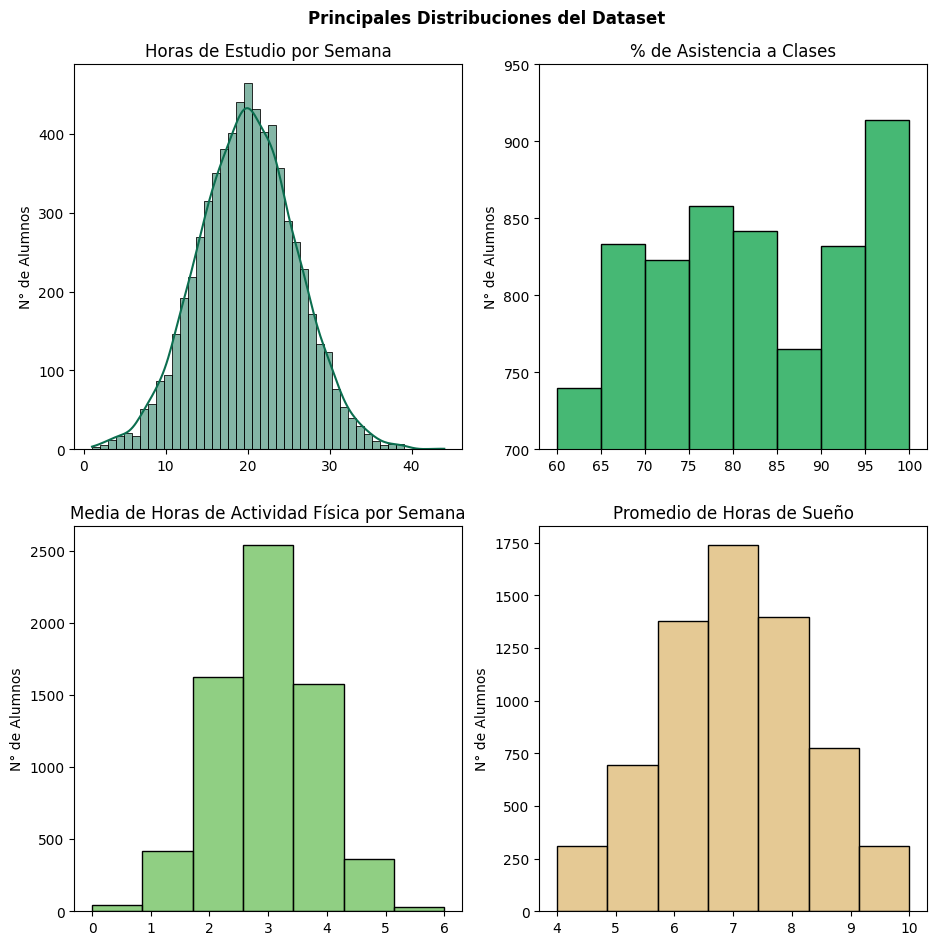
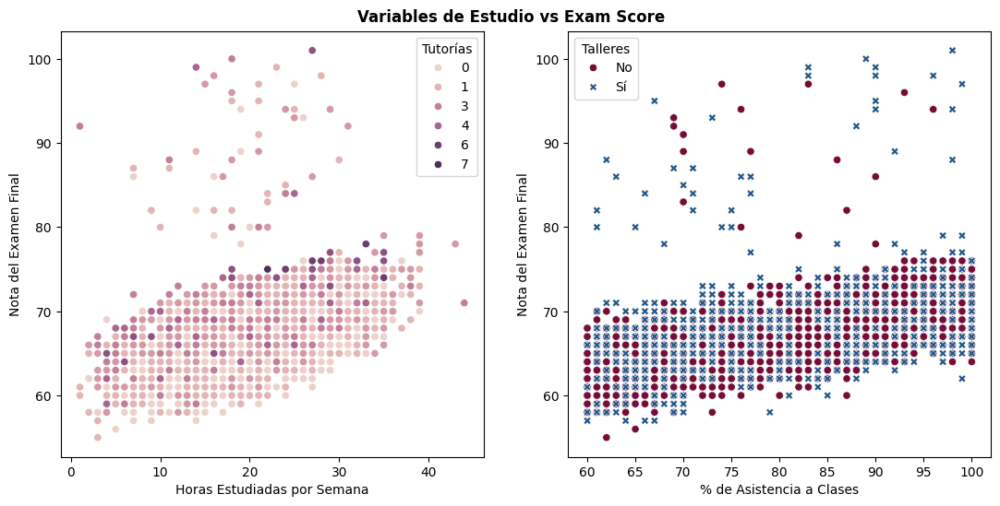
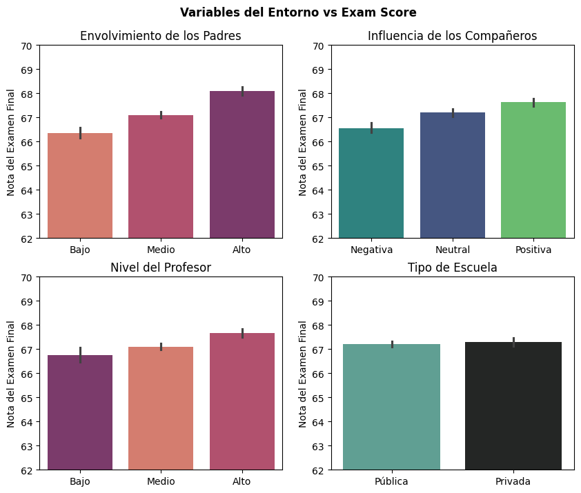
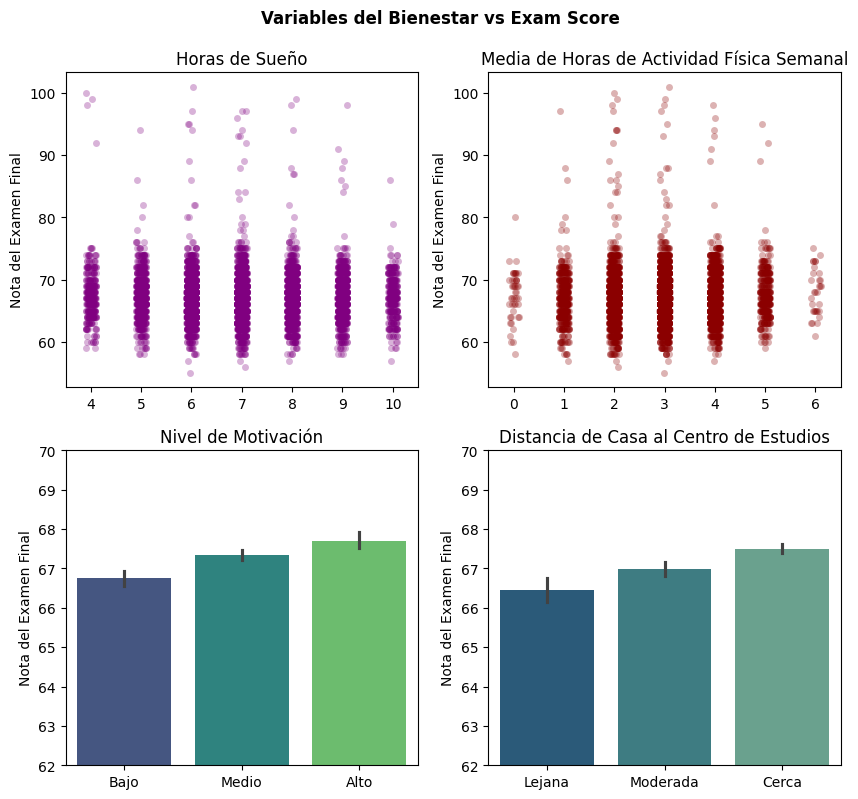
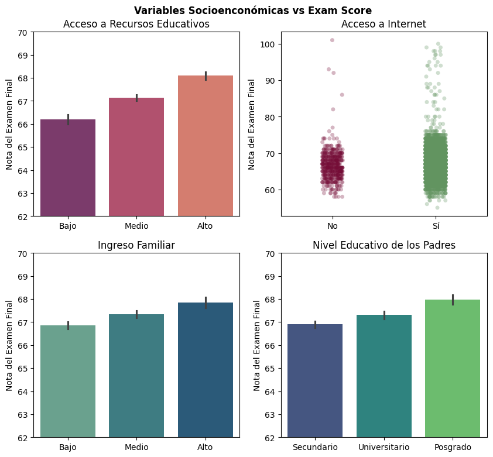

# Análisis del Rendimiento Estudiantil: Un Enfoque Exploratorio Profundo

## 📝 Descripción del Proyecto

Este proyecto es un **Análisis Exploratorio de Datos (EDA)** completo y sistemático sobre un dataset que contiene información diversa de estudiantes y su desempeño académico, medido por la **Nota del Examen Final (`Exam_Score`)**. El objetivo central es descubrir y comprender los factores más influyentes en el rendimiento estudiantil, explorando variables clasificadas en áreas clave como el estudio, el entorno social y educativo, el bienestar personal y las condiciones socioeconómicas. A través de visualizaciones detalladas y un análisis crítico, este informe presenta los *insights* clave obtenidos.

## 🎯 Motivación y Objetivos

Como analista de datos en formación, con la ambición de convertirme en científico de datos y con planes de postular a una maestría en Data Science en la Universidad Nacional de Ingeniería en Perú, este proyecto representa un pilar fundamental en mi ruta de aprendizaje. Los objetivos específicos que impulsaron este trabajo fueron:

* **Aplicación Práctica:** Consolidar mis habilidades en la manipulación, limpieza, transformación y visualización de datos utilizando el ecosistema de Python (Pandas, Matplotlib, Seaborn).
* **Generación de *Insights* Accionables:** Identificar patrones, tendencias y correlaciones significativas que no solo expliquen el rendimiento académico, sino que también puedan informar futuras intervenciones educativas o decisiones de políticas.
* **Desarrollo del Pensamiento Crítico:** Ejercitar la capacidad de interpretar gráficos de manera matizada, justificar las decisiones de visualización (por ejemplo, la elección entre `barplot` y `stripplot`), y extraer conclusiones sólidas basadas en la evidencia de los datos.
* **Construcción de un Portafolio:** Crear un proyecto bien documentado y reproducible que demuestre mis capacidades en el análisis de datos a futuros empleadores o instituciones académicas.

## 🛠️ Metodología y Enfoque

El desarrollo de este análisis siguió un proceso estructurado para asegurar la robustez y fiabilidad de los hallazgos:

### 1. Limpieza y Preprocesamiento de Datos

La calidad de los datos es la base de cualquier análisis confiable. Las etapas iniciales incluyeron:

* **Verificación y Corrección de Tipos de Datos:** Se inspeccionaron todas las columnas para asegurar que sus tipos de datos (numéricos, categóricos) fueran los adecuados para el análisis subsiguiente.
* **Gestión de Valores Nulos:** Se identificaron y trataron los valores nulos, optando por la imputación mediante la moda en las columnas categóricas para preservar la integridad de las distribuciones y no introducir sesgos.
* **Traducción de Variables Categóricas:** Para mejorar la legibilidad y la comprensión del informe final, se tradujeron los valores categóricos relevantes (ej., 'Low' a 'Bajo', 'Yes' a 'Sí', 'Positive' a 'Positiva', 'High School' a 'Secundario') al castellano, utilizando bucles eficientes con `numpy.where` y diccionarios de mapeo.

### 2. Análisis Exploratorio de Datos (EDA) Detallado

El corazón de este proyecto fue el EDA, diseñado para desvelar las distribuciones de las variables y las relaciones complejas entre ellas y la nota del examen.

#### a. Distribuciones Principales del Dataset

Una comprensión inicial de la distribución de las variables clave fue fundamental. Se utilizaron histogramas para visualizar la forma, el centro y la dispersión de estas variables:

* **Horas de Estudio por Semana:** Muestra una distribución aproximadamente normal, concentrada alrededor de las 20-25 horas semanales, indicando que la mayoría de los estudiantes dedican un tiempo moderado al estudio.
* **Porcentaje de Asistencia a Clases:** Se observa una alta concentración en los valores superiores, revelando que la mayoría de los estudiantes tienen una asistencia muy buena, generalmente por encima del 80%.
* **Promedio de Horas de Sueño:** La distribución sugiere que la mayoría de los estudiantes duermen entre 6 y 8 horas por noche, un rango considerado óptimo para el rendimiento cognitivo.

#### b. Distribución de la Nota del Examen Final

La comprensión de la distribución de la `Exam_Score` fue un punto de inflexión en el análisis. Este histograma reveló que:

* La **inmensa mayoría de las notas se concentran fuertemente entre 60 y 75 puntos**, formando una distribución asimétrica hacia la izquierda.
* Las notas **superiores a 80 son considerablemente raras**, y las que exceden los 90 puntos son excepcionales.

Este hallazgo es crucial: cualquier factor asociado con una mayor presencia de estudiantes en el rango de notas "raras" (por encima de 80) adquiere una significancia mucho mayor, ya que no son resultados triviales de alcanzar.

*(Nota: La distribución de "Notas del Examen Final" está incluida en el gráfico "Distribuciones Principales del Dataset" para una visión consolidada. Se enfatiza su importancia aquí por separado para el análisis)*

Esta exploración inicial proporciona un contexto valioso sobre las características de la población estudiantil en el dataset.

#### c. Relaciones con Variables de Estudio vs. `Exam_Score`

Se investigó cómo el esfuerzo y la dedicación al estudio se relacionan con el rendimiento académico. Se utilizaron `scatterplot`s para visualizar la dispersión de puntos y las tendencias.

* **Horas de Estudio vs. Nota Final (con Tutorías):**
    * Existe una **clara correlación positiva** entre las horas estudiadas y la nota del examen: a más horas de estudio, mayor es la nota promedio alcanzada. Sin embargo, la dispersión de los puntos en los rangos medios de horas de estudio sugiere que el tiempo no es el único factor determinante.
    * En cuanto a las **sesiones de tutoría**, se observa que los estudiantes que recibieron un mayor número de tutorías (especialmente 4 o más) tienden a congregarse en los rangos de notas más altas, particularmente entre aquellos que también dedican una cantidad considerable de horas al estudio. Esto sugiere que las tutorías pueden ser un **catalizador para alcanzar el rendimiento sobresaliente**, o son un recurso buscado por estudiantes ya muy comprometidos con su aprendizaje.
* **Asistencia vs. Nota Final (con Actividades Extracurriculares):**
    * Hay una **correlación positiva muy fuerte** entre el porcentaje de asistencia a clases y la nota final. Los estudiantes con baja asistencia (por ejemplo, por debajo del 80%) rara vez logran notas altas. Una asistencia alta (por encima del 90%) parece ser una **condición casi necesaria** para acceder a los rangos de notas superiores.
    * La participación en **Actividades Extracurriculares** (`Talleres` en la leyenda) muestra una asociación notable con un mejor rendimiento. Los estudiantes que participan activamente (`Sí`) están desproporcionadamente representados en los rangos de notas y asistencia más altos. Esto podría indicar que la participación en estas actividades es un **proxy para habilidades de gestión del tiempo, disciplina o un equilibrio vida-estudio**, factores que contribuyen al éxito académico.

#### d. Relaciones con Variables del Entorno vs. `Exam_Score`

Se analizó la influencia de los factores externos y el entorno educativo en el desempeño estudiantil. Se utilizaron `barplot`s con rangos de `ylim` ajustados para observar las diferencias promedio de manera más precisa.

* **Envolvimiento de los Padres:** Se observa una **clara y consistente correlación positiva**: a mayor involucramiento de los padres (pasando de 'Bajo' a 'Medio' y luego a 'Alto'), mayor es la nota promedio del examen. Los pequeños intervalos de confianza confirman la solidez de esta tendencia.
* **Influencia de los Compañeros:** La **influencia positiva** de los compañeros se asocia con promedios de notas significativamente más altos. En contraste, una influencia negativa se correlaciona con promedios de notas más bajos, destacando el impacto del círculo social en el rendimiento.
* **Nivel del Profesor (`Teacher_Quality`):** La **calidad percibida del profesor** también muestra una **correlación positiva** con la nota del examen. Un nivel de profesor 'Alto' se asocia con promedios de notas consistentemente superiores en comparación con niveles 'Bajo' o 'Medio'.
* **Tipo de Escuela:** Un hallazgo importante es que el **Tipo de Escuela** (Pública vs. Privada) muestra una **diferencia mínima e insignificante** en la nota promedio del examen. Los intervalos de confianza se solapan extensamente, lo que sugiere que, para este dataset, el tipo de institución no es un predictor relevante del rendimiento.

#### e. Relaciones con Variables de Bienestar vs. `Exam_Score`

Se examinó cómo el bienestar personal del estudiante se relaciona con su desempeño académico. Se emplearon `stripplot`s para las variables numéricas con pocos valores únicos y `barplot`s para las categóricas.

* **Horas de Sueño:** Aunque la mayoría de los estudiantes se agrupan en las notas promedio, el análisis del `stripplot` revela que la **mayoría de los estudiantes con notas sobresalientes (superiores a 80) tienden a dormir entre 6 y 8 horas**. Los extremos de sueño (muy poco - 4-5 horas, o demasiado - 9-10 horas) rara vez se asocian con estas notas más altas, lo que indica un rango óptimo de sueño para el rendimiento cognitivo.
* **Media de Horas de Actividad Física Semanal:** Este gráfico muestra una relación no lineal muy interesante: los estudiantes que no realizan actividad física (0 horas) o que realizan una cantidad excesiva (6 horas) rara vez superan los 80 puntos. En contraste, la **mayoría de los estudiantes con las notas más altas se concentran en el rango de 2 a 3 horas de actividad física semanal**. Esto sugiere que un equilibrio en la actividad física es más beneficioso para el éxito académico.
* **Nivel de Motivación:** Una **correlación directa y muy fuerte** es evidente: a mayor nivel de motivación ('Bajo' a 'Alto'), consistentemente mejores son las notas promedio. Los intervalos de confianza estrechos refuerzan la solidez de esta relación.
* **Distancia de Casa al Centro de Estudios:** Se observa una **tendencia clara**: a medida que la distancia del hogar al centro de estudios disminuye (de 'Lejana' a 'Cerca'), se percibe una mejora ligera pero consistente en las notas promedio. Esto podría implicar que menos tiempo de traslado contribuye positivamente al bienestar y, por ende, al rendimiento.

#### f. Relaciones con Variables Socioeconómicas vs. `Exam_Score`

Finalmente, se exploró cómo los factores socioeconómicos influyen en la nota del examen. Las decisiones sobre el tipo de gráfico (barplot vs. stripplot) se tomaron para resaltar la información más relevante de cada variable.

* **Acceso a Recursos Educativos:** Existe una **correlación positiva muy clara**: a mayor acceso a recursos educativos (desde 'Bajo' hasta 'Alto'), el promedio de la `Exam_Score` es consistentemente más alto, con diferencias bien definidas entre las categorías.
* **Acceso a Internet:** El `stripplot` fue la elección ideal aquí. Muestra visualmente que la mayoría de los estudiantes tienen acceso a internet (`Sí`). Más allá del volumen, el gráfico demuestra que la **presencia de puntos en el rango de notas más altas (por encima de 80, que son raras) es significativamente mayor en el grupo con acceso a internet (`Sí`)** en comparación con el grupo 'No'. Esto sugiere que el acceso a internet está asociado con la capacidad de alcanzar un rendimiento sobresaliente.
* **Ingreso Familiar:** Se observa una **clara correlación positiva**: a mayor ingreso familiar (de 'Bajo' a 'Alto'), las notas promedio del examen tienden a ser más altas y de forma consistente.
* **Nivel Educativo de los Padres:** El `barplot` fue preferido aquí para mostrar las medias y evitar la posible confusión visual que un `stripplot` podría generar por el volumen de datos en una categoría (ej. 'Secundario'). El gráfico revela una **correlación positiva clara**: a medida que el nivel educativo de los padres aumenta (de 'Secundario' a 'Universitario' y 'Posgrado'), el promedio de la `Exam_Score` de los estudiantes tiende a ser consistentemente mejor.

## 💡 Conclusiones Generales y Hallazgos Clave

Este exhaustivo Análisis Exploratorio de Datos ha revelado que el rendimiento estudiantil es un fenómeno complejo, influenciado por una intrincada red de factores que abarcan desde el esfuerzo individual hasta el entorno socioeconómico y el bienestar personal.

Los **factores consistentemente asociados con un mejor rendimiento promedio** incluyen:

* **Variables de Entorno:** Alto involucramiento parental, influencia positiva de compañeros, y alta calidad del profesor.
* **Variables de Bienestar:** Un alto nivel de motivación, y una distancia más cercana al centro de estudios.
* **Variables Socioeconómicas:** Mayor acceso a recursos educativos, un ingreso familiar más elevado, y un mayor nivel educativo de los padres.
* **Variables de Estudio:** Una mayor cantidad de horas de estudio por semana, y una mayor asistencia a clases.

Para el **rendimiento excepcional** (notas superiores a 80-85, consideradas raras en este dataset), los *insights* clave son:

* **Horas de Sueño:** Los estudiantes de alto rendimiento tienden a dormir en un **rango óptimo de 6 a 8 horas**.
* **Actividad Física:** Existe una **cantidad óptima de actividad física (2-3 horas semanales)** que se correlaciona con las notas más altas, mientras que la falta total o el exceso de ejercicio se asocian con rendimientos más bajos.
* **Participación en Actividades Extracurriculares:** Asociado con una mayor tendencia a alcanzar notas altas y a tener una alta asistencia.
* **Acceso a Internet:** Los estudiantes con acceso a internet muestran una mayor capacidad para alcanzar las notas más altas y raras.
* **Sesiones de Tutoría:** Un mayor número de sesiones de tutoría parece ser un factor que contribuye a que los estudiantes alcancen las notas más altas, especialmente en combinación con un estudio dedicado.

Es importante destacar que, en este dataset, el **Tipo de Escuela (Pública/Privada)** no mostró un impacto significativo en la `Exam_Score` promedio, lo cual es un hallazgo valioso que desafía suposiciones comunes.

Este análisis ha proporcionado una base sólida de comprensión del dataset, sirviendo como un excelente punto de partida para futuros modelos predictivos o análisis inferenciales que busquen cuantificar aún más el impacto de estos factores.

## 🛠️ Tecnologías Utilizadas

* **Python 3.x**
* **Pandas:** Para manipulación y análisis de datos.
* **Matplotlib:** Para la creación de gráficos estáticos y personalización de visualizaciones.
* **Seaborn:** Para la creación de visualizaciones estadísticas avanzadas y estéticamente agradables.
* **NumPy:** Para operaciones numéricas eficientes.
* **Herramientas de IA (ej. Gemini/Copilot):** Utilizadas para asistencia en la sintaxis del código, depuración y mejora de la eficiencia en el proceso de desarrollo y documentación.

## 🧑‍💻 Autor

[Christian Vizcardo]
[www.linkedin.com/in/christian-vizcardo]

---
*Este proyecto es un testimonio de la dedicación a la disciplina, la mejora continua y el poder del análisis de datos para extraer conocimiento significativo.*